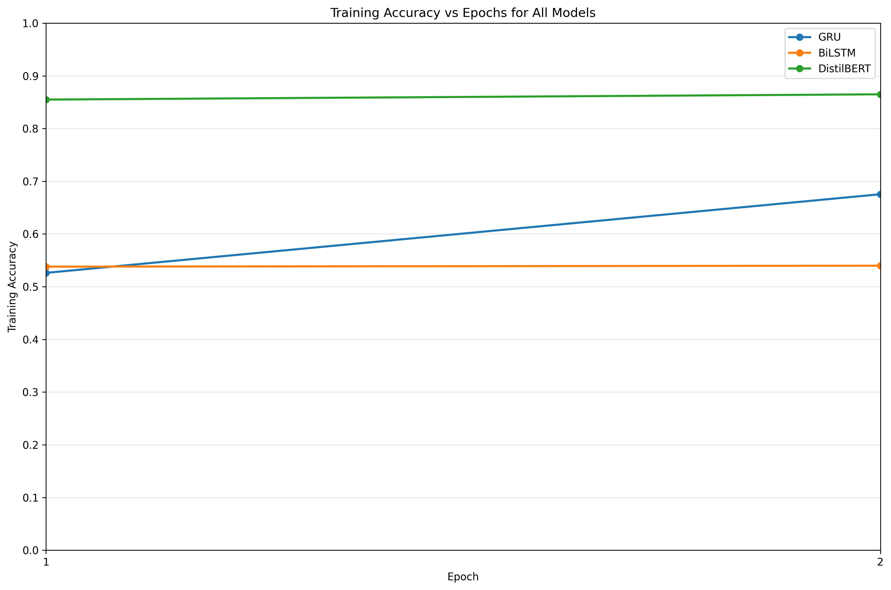
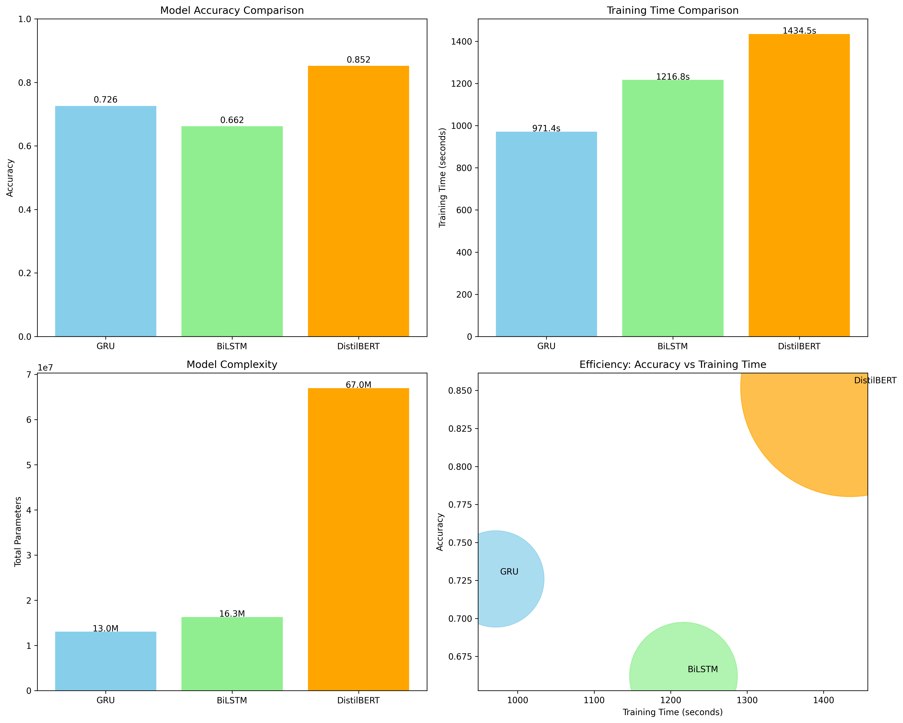

# MRP: Mini Research Problem

MSCS2201-2: Artificial Intelligence @ Sofia University

# Sentiment Model Comparison

## Project Goal

This project aims to compare the performance of different neural network architectures for sentiment analysis on movie
reviews. The goal is to evaluate how traditional recurrent neural networks (RNNs) compare to modern transformer-based
models in terms of accuracy, training efficiency, and model complexity.

## Dataset Description

The project uses the **IMDb Large Movie Review Dataset**, which contains:

- 50,000 movie reviews labeled as positive or negative
- 25,000 reviews for training and 25,000 for testing
- Each review is labeled with a binary sentiment score (0 = negative, 1 = positive)
- Reviews vary in length from a few sentences to several paragraphs

For this comparison, we use a subset of 5,000 training reviews and 1,000 test reviews to ensure reasonable training
times while maintaining statistical significance.

## Models Compared

This project compares the following neural network architectures:

- **GRU (Gated Recurrent Unit)**: A type of recurrent neural network optimized for sequence processing
- **BiLSTM (Bidirectional LSTM)**: Long Short-Term Memory network that processes sequences in both directions
- **DistilBERT**: A smaller, faster version of BERT that maintains high performance

The project trains, evaluates, and visualizes the accuracy of each model to provide insights into the trade-offs between
model complexity, training time, and predictive performance.

---

## Requirements

Python 3.12 recommended. Install dependencies:

```bash
pip install -r requirements.txt
```

## Run the project

```bash
python sentiment_model_comparison.py
```

## Results

### Training Progress

Training Accuracy of each epoch

| Epoch | GRU    | BiLSTM | DistilBERT |
|-------|--------|--------|------------|
| 1     | 0.544  | 0.5474 | 0.846      |
| 2     | 0.6932 | 0.5324 | 0.837      |
| 3     | 0.8228 | 0.5756 | 0.844      |
| 4     | 0.9276 | 0.6542 | 0.848      |
| 5     | 0.9818 | 0.7702 | 0.844      |
| 6     | 0.9958 | 0.876  | 0.847      |
| 7     | 0.9996 | 0.9408 | 0.855      |
| 8     | 0.9998 | 0.973  | 0.852      |

### Model Testing Performance Summary

| Model      | Accuracy | Training Time (s) | Total Parameters | Trainable Parameters | Parameters (Millions) |
|------------|----------|-------------------|------------------|----------------------|-----------------------|
| GRU        | 0.726    | 971.38            | 13,042,370       | 13,042,370           | 13.04                 |
| BiLSTM     | 0.662    | 1,216.81          | 16,287,170       | 16,287,170           | 16.29                 |
| DistilBERT | 0.852    | 1,434.49          | 66,955,010       | 66,955,010           | 66.96                 |

### Visualization

#### Training Progress



#### Testing Results

The project generates a comprehensive comparison chart showing:

- Model accuracy comparison
- Training time comparison
- Model complexity (parameter count)
- Efficiency (accuracy vs training time)



## Key Findings

---

### Training Performance Analysis

1. **Training Convergence Patterns**:
    - **GRU**: Showed rapid learning, reaching 99.98% training accuracy by epoch 8 with steady improvement
    - **BiLSTM**: Demonstrated slower but consistent learning, reaching 97.3% training accuracy by epoch 8
    - **DistilBERT**: Achieved high performance early (84.6% in epoch 1) with minimal improvement over subsequent epochs

2. **Model Efficiency Trade-offs**:
    - **DistilBERT**: Highest test accuracy (85.2%) but longest training time (1,434.49s) and largest model size (66.96M
      parameters)
    - **GRU**: Best training efficiency with 72.6% test accuracy in 971.38s and smallest model size (13.04M parameters)
    - **BiLSTM**: Lowest test accuracy (66.2%) despite longer training time (1,216.81s) than GRU

3. **Training vs. Testing Performance**:
    - **RNN Models (GRU/BiLSTM)**: Showed significant overfitting with training accuracies approaching 100% while test
      accuracies remained much lower
    - **DistilBERT**: Demonstrated better generalization with training and test accuracies being much closer (85.2% vs ~
      85%)

4. **Architecture Insights**:
    - **Transformer superiority**: DistilBERT's attention mechanism provided significantly better feature extraction for
      sentiment analysis
    - **RNN limitations**: Both GRU and BiLSTM struggled with generalization despite excellent training performance
    - **Model complexity**: More parameters don't guarantee better performance (BiLSTM had more parameters than GRU but
      lower accuracy)

5. **Practical Implications**:
    - For production use requiring high accuracy: DistilBERT is the clear choice despite longer training time
    - For resource-constrained environments: GRU offers the best accuracy-to-efficiency ratio
    - BiLSTM may benefit from additional regularization techniques to improve generalization
